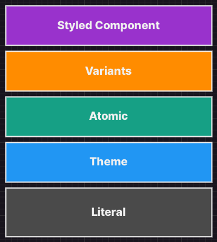

# mincho
Natural CSS in TypeScript

> [!WARNING]
> This project is still in WIP, which means it is not ready for production.

  
   
  

- [Demo with StackBliz](https://stackblitz.com/~/github.com/black7375/mincho-example-stackblitz?file=src/App.css.ts)

## Documentation

See [`@mincho-js/css`](./packages/css) README.

## Motivation

- [Rethinking CSS in JS](https://dev.to/black7375/rethinking-css-in-js-5dip)

It started with contemplation on approaches and management methods for CSS styling.

Methodologies for CSS selectors can be largely divided into visual hierarchy and semantic hierarchy.

The visual hierarchy uses visual names like `.text-red { color: red; }`,  
while the semantic hierarchy uses meaningful names like `.error { color: red; }`.

Due to these characteristics, the methods of achieving goals also differ.  
For example, what if we need to create various designs with the same content, like [as CSS Zen Garden](https://csszengarden.com/pages/alldesigns/)?

The visual approach would keep the CSS fixed but change the HTML to achieve the goal,  
while the semantic approach would keep the HTML the same but change the CSS to achieve the goal.

As a practical example of dealing with visual hierarchy, there's [Tailwind CSS](https://tailwindcss.com/), and for semantic hierarchy, there's [Stitches](https://stitches.dev/).  
If you look at Tailwind's [Text Color](https://tailwindcss.com/docs/text-color), you can see it's visually intuitive with classes like `text-black`, `text-white`.  
Stitches has invented an API called [Variants](https://stitches.dev/docs/variants), which aligns with the [original purpose](https://www.w3.org/QA/Tips/goodclassnames) of CSS classes as element identifiers[[1](https://www.w3.org/TR/html401/struct/global.html#h-7.5.2), [2](https://html.spec.whatwg.org/multipage/dom.html#classes)], and makes it very easy to apply [BEM](https://getbem.com/).

I believed that these two approaches could reconcile and form a dialectical triad.

Just like how the cool and refreshing taste of mint harmonizes with the sweetness of chocolate in mint chocolate!

## Vision

**"Build your own design system"** is our vision.  
We aim not only to integrate visual hierarchy and semantic hierarchy but also to improve the design process itself.

This is achieved under several principles:
1. Be declarative rather than listing logic
2. The API of each layer should be isomorphic
3. Expression and content presuppose each other, so they should be considered
4. If the hierarchy (perspective) is different, the law of excluded middle applies
5. Consider both developers and designers

  

Our CSS in JS framework will consist of 5 layers (Literal, Theme, Atomic, Variant, Styled Component).
1. Literal: Provides various CSS-specific syntax of CSS preprocessors, considering the syntactic limitations of JavaScript
2. Theme: Design token values and customization for Color, Typography, Spaces, etc.
3. Atomic: Atomic styles that map to visual values
4. Variants: Styles for reusable blocks
5. Styled Component: Binding with JSX components

This can also be compared with State[[1](https://react-spectrum.adobe.com/architecture.html), [2](https://www.adebayosegun.com/blog/the-future-of-chakra-ui)]:
1. JSX: Binds HTML and JS
2. State hook: Logic independent of view platform
3. Behavior hook: Handles events, accessibility, internationalization, etc. for platform APIs (DOM, React Native, etc.)
4. Headless Component: Provides binding of JSX and hooks for use
5. Component: Component blocks including design

However, since we cannot provide all features from the beginning, we plan to achieve them step by step.
1. Natural CSS in TypeScript: We will bind various CSS preprocessing features to be specialized for TypeScript.
2. CSS in JS for Scalable: We will achieve the integration of visual hierarchy (AtomicCSS) and semantic hierarchy (Variants), which was the original goal.
3. Build your own design system: It functions as a framework for creating design systems through design token management and Figma plugins, among others.

## Features

Currently, most of the features are related to the CSS preprocessor.

- [CSS Literals](https://github.com/mincho-js/working-group/blob/main/text/000-css-literals.md): Expressing more natural CSS in TypeScript.
- [CSS Nesting](https://github.com/mincho-js/working-group/blob/main/text/001-css-nesting.md): Expressing better nesting and referencing.
- [CSS Rules](https://github.com/mincho-js/working-group/blob/main/text/002-css-rules.md): Expressing static and dynamic styles for reusable blocks.

## Contributing

Interested in contributing?  
We have a [contributing guide](./CONTRIBUTING.md).

If you need support, ask in [discussions](https://github.com/mincho-js/mincho/discussions).  
Participation is open. Welcome! :hugs: :hugs:

## Support

Do you have any questions?  
Feel free to ask questions in [discussions](https://github.com/mincho-js/mincho/discussions).

## Inspired

This project was inspired by the syntax and functionality of various projects.  
Without them, this would not be possible!!

### Special Thanks

- [Vanilla Extract](https://vanilla-extract.style/): This project is based on vanilla extract. It has a very fancy API.
- [Macaron](https://macaron.js.org/): It became the basis for co-location.
- [Sass](https://sass-lang.com/): Inspired so many different features [variables](https://sass-lang.com/documentation/variables/), [nesting](https://sass-lang.com/documentation/style-rules/declarations/#nesting), [parent selector](https://sass-lang.com/documentation/style-rules/parent-selector/), [`@mixin`](https://sass-lang.com/documentation/at-rules/mixin/) ...etc

### CSS Preprocessors or CSS Frameworks
- [Less](https://lesscss.org/): Inspired by [merge properties](https://lesscss.org/features/#merge-feature).
- [Stylus](https://stylus-lang.com): Inspired by  [property lookup](https://stylus-lang.com/docs/variables.html#property-lookup).
- [Tailwind CSS](https://tailwindcss.com): Inspired by [important modifier](https://tailwindcss.com/docs/configuration#important-modifier).

### CSS in JS
- [Panda CSS](https://panda-css.com/): Inspired by the [conditional styles](https://panda-css.com/docs/concepts/conditional-styles).
- [Griffel](https://griffel.js.org): Inspired by the [`@keyframes`(anonymous at-rules)](https://griffel.js.org/react/api/make-styles/#keyframes-animations).
- [JSS](https://cssinjs.org): Inspired by the [reference a local rule ](https://cssinjs.org/jss-plugin-nested/?v=v10.10.0#use-rulename-to-reference-a-local-rule-within-the-same-style-sheet).
- [Stitches](https://stitches.dev/): Inspired by the [variants](https://stitches.dev/docs/variants).

## License

MIT License © 2023-Present [Minseok Youn](https://github.com/black7375)
